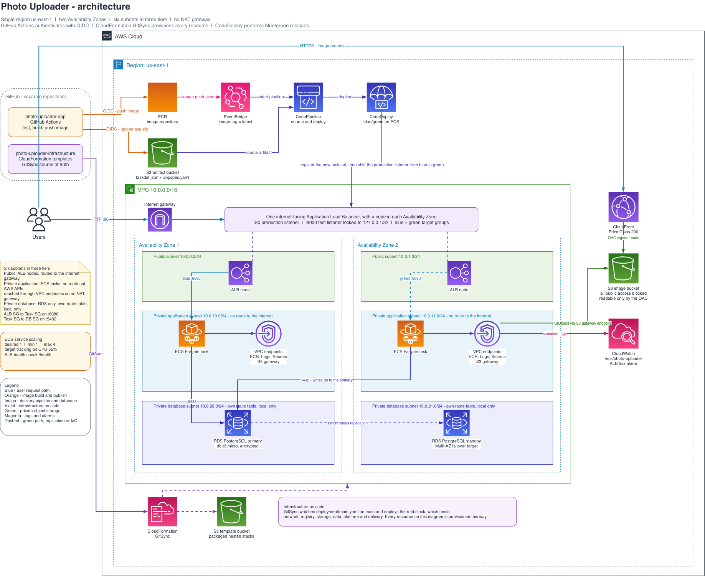

# photo-uploader-infrastructure

CloudFormation templates for the Photo Uploader lab: a highly available,
containerised photo gallery running on Amazon ECS Fargate in a single region.
Application code lives in a separate repository,
[photo-uploader-app](https://github.com/leandreAlly/photo-uploader-app).



> The diagram source is [`diagrams/architecture.drawio`](diagrams/architecture.drawio).
> Export a PNG next to it with **File → Export as → PNG** in draw.io after any
> change, so the image above stays in step with the templates.

## What gets built

| Layer | Resources |
| --- | --- |
| Network | VPC, six subnets in three tiers across two AZs, internet gateway, route tables, security groups, VPC endpoints for ECR, CloudWatch Logs, Secrets Manager and S3 |
| Registry | Private ECR repository, lifecycle policy, and the IAM role the application repository assumes through OIDC |
| Storage | Private S3 image bucket and a CloudFront distribution restricted to it by an Origin Access Control |
| Data | RDS PostgreSQL with Multi-AZ, credentials generated into Secrets Manager |
| Platform | Application Load Balancer, ECS cluster and service, blue and green target groups, auto scaling, CloudWatch log group and alarm |
| Delivery | Artifact bucket, CodePipeline, CodeDeploy application and deployment group, EventBridge rule |

### Subnet layout

Three tiers, two Availability Zones, six subnets:

| Tier | CIDRs | Holds | Routing |
| --- | --- | --- | --- |
| Public | `10.0.0.0/24`, `10.0.1.0/24` | ALB nodes | Default route to the internet gateway |
| Private application | `10.0.10.0/24`, `10.0.11.0/24` | ECS Fargate tasks | No route out; AWS APIs through VPC endpoints |
| Private database | `10.0.20.0/24`, `10.0.21.0/24` | RDS primary and standby | Own route tables, local only |

Giving the database its own tier keeps the DB subnet group separate from the
application subnets, so the Multi-AZ pair sits in subnets that route nowhere at
all. There is no NAT gateway anywhere in the design: every AWS call a task makes
goes through a VPC endpoint.

## Repository layout

```
templates/
  bootstrap.yaml            template bucket + the OIDC role the packaging workflow uses
  main.yaml                 root stack, nests everything below
  nested-stacks/
    network.yaml            VPC, subnets, route tables, security groups, endpoints
    registry.yaml           ECR repository + GitHub Actions OIDC role
    storage.yaml            S3 image bucket + CloudFront with OAC
    data.yaml               RDS PostgreSQL + Secrets Manager
    platform.yaml           ALB, ECS cluster/service, auto scaling, logs
    delivery.yaml           artifact bucket, CodePipeline, CodeDeploy, EventBridge
deployment/
  bootstrap.yaml            GitSync config for the bootstrap stack
  main.yaml                 GitSync config for the root stack (parameters live here)
packaged/
  main.yaml                 generated: root template with S3 template URLs
diagrams/
  architecture.drawio       diagram source
```

`templates/nested-stacks/` holds **nested stacks**, not CloudFormation Modules.
Modules are a separate registry feature; these are plain
`AWS::CloudFormation::Stack` resources.

## Deploying

### 1. Bootstrap

Creates the bucket packaged templates are uploaded to and the role the
packaging workflow assumes.

```bash
aws cloudformation deploy \
  --template-file templates/bootstrap.yaml \
  --stack-name photo-uploader-bootstrap \
  --capabilities CAPABILITY_IAM \
  --parameter-overrides ProjectName=photo-uploader GitHubOwner=<owner> \
    InfrastructureRepo=photo-uploader-infrastructure GitHubOwnerId=<numeric id> \
    CreateOidcProvider=true
```

Set `CreateOidcProvider=false` if the account already has a GitHub OIDC
provider - IAM allows only one per URL per account.

Put the stack's outputs into this repository's Actions configuration:
`AWS_PACKAGE_ROLE_ARN` and `TEMPLATE_BUCKET` as **secrets**, `AWS_REGION` as a
variable. Role ARNs carry the account ID, and secrets are redacted from
workflow logs.

### 2. Package

Pushing to `main` runs `.github/workflows/package.yml`, which lints every
template, runs `aws cloudformation package` and commits the result to
`packaged/main.yaml`.

### 3. First deploy, with an empty registry

An ECS service cannot start without an image, and no image can be pushed before
the registry exists. The root stack gates the platform and delivery stacks
behind `ImageTag` being non-empty, so the first deploy leaves `ImageTag` empty:

```yaml
# deployment/main.yaml
  ImageTag: ''
  ServiceTaskDefinitionArn: ''
```

```bash
aws cloudformation deploy \
  --template-file packaged/main.yaml \
  --stack-name photo-uploader-main \
  --capabilities CAPABILITY_IAM \
  --parameter-overrides ProjectName=photo-uploader S3PrefixListId=<pl-...> \
    GitHubOwner=<owner> ApplicationRepo=photo-uploader-app \
    GitHubOwnerId=<numeric id> RepositoryName=photo-uploader-app
```

Find the S3 prefix list id with:

```bash
aws ec2 describe-managed-prefix-lists --region us-east-1 \
  --filters Name=prefix-list-name,Values=com.amazonaws.us-east-1.s3 \
  --query 'PrefixLists[0].PrefixListId' --output text
```

CloudFormation Git sync can only **update** a stack, never create one, so this
first deploy has to be a direct `aws cloudformation deploy` or a console
creation.

### 4. Push an image, then deploy the rest

Run the application repository's workflow. It pushes an image tagged `latest`
and skips publishing the deployment bundle while the artifact bucket does not
exist yet. Then set `ImageTag: latest` in `deployment/main.yaml` and deploy
again - the platform and delivery stacks appear.

### 5. Attach Git sync

```bash
aws codestar-connections create-repository-link \
  --connection-arn <connection arn> --owner-id <owner> \
  --repository-name photo-uploader-infrastructure

aws codestar-connections create-sync-configuration \
  --sync-type CFN_STACK_SYNC --branch main \
  --config-file deployment/main.yaml \
  --repository-link-id <link id> \
  --resource-name photo-uploader-main \
  --role-arn <sync role arn> \
  --publish-deployment-status ENABLED --trigger-resource-update-on ANY_CHANGE
```

The sync role needs its own permissions to create the stack's resources.
Grant the services the templates actually use up front, scoped by region, and
verify with `aws iam simulate-principal-policy` against real resource ARNs
rather than grepping the policy for action names.

## Parameters worth knowing

Everything is set in `deployment/main.yaml`.

| Parameter | Default | Notes |
| --- | --- | --- |
| `ImageTag` | - | Empty on the first deploy; `latest` afterwards |
| `ServiceTaskDefinitionArn` | `''` | Empty on first create, then pin it - see below |
| `DbMultiAz` | `true` | Adds roughly ten minutes to a create |
| `TestListenerCidr` | `127.0.0.1/32` | Who may reach the `:9000` test listener |
| `CpuTargetUtilization` | `55` | Target tracking threshold |
| `MinCapacity` / `MaxCapacity` | `1` / `4` | ECS service auto scaling bounds |
| `CloudFrontPriceClass` | `PriceClass_200` | |

### Why `ServiceTaskDefinitionArn` exists

ECS refuses any CloudFormation update that changes `TaskDefinition` on a service
whose deployment controller is `CODE_DEPLOY`:

```
Unable to update task definition on services with a CODE_DEPLOY
deployment controller. Use AWS CodeDeploy to trigger a new deployment.
```

Any template edit that touches the task definition triggers this, not just the
image tag. The service therefore takes the revision to run as a parameter and
falls back to the template's own resource when that parameter is empty. Leave it
empty on the first create, then pin it to the revision that was registered.
CodeDeploy owns the revision from then on.

## Operating notes

- **Git sync attempts each commit SHA once.** Recreating the sync configuration
  only re-runs if there is a SHA it has not tried; to retry a failed one you
  need a new commit.
- **A change that renders an identical template deploys nothing.** When
  demonstrating Git sync, change something with a visible effect such as
  `CpuTargetUtilization` or `DbBackupRetentionDays`.
- **`UPDATE_ROLLBACK_FAILED`** is recovered with
  `aws cloudformation continue-update-rollback --stack-name photo-uploader-main`.
- **Recreating the stack changes every generated name** - role ARNs, the
  CloudFront domain, the Secrets Manager ARN. Bucket names, the log group and
  the task family stay stable. Refresh the application repository's variables
  from the new stack outputs afterwards.

## Tearing down

S3 buckets must be emptied first, including every object version, or the delete
fails.

```bash
aws codestar-connections delete-sync-configuration \
  --sync-type CFN_STACK_SYNC --resource-name photo-uploader-main
# empty the images, artifacts and templates buckets, then
aws cloudformation delete-stack --stack-name photo-uploader-main
aws cloudformation delete-stack --stack-name photo-uploader-bootstrap
```

CloudFormation leaves ECS task definitions registered and does not remove
policies that were added to a shared sync role by hand; clean both up
separately.
